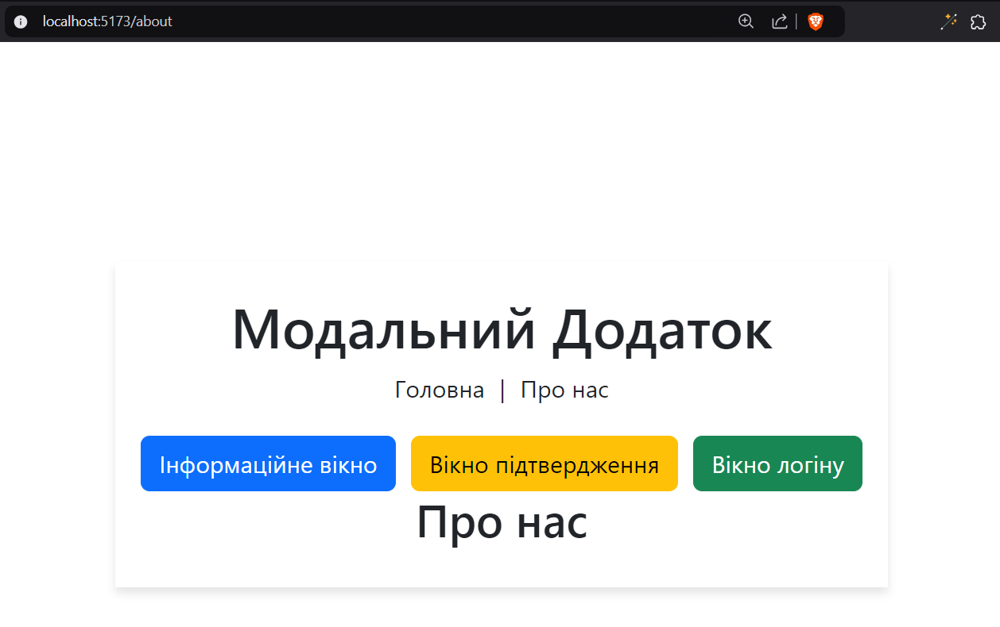
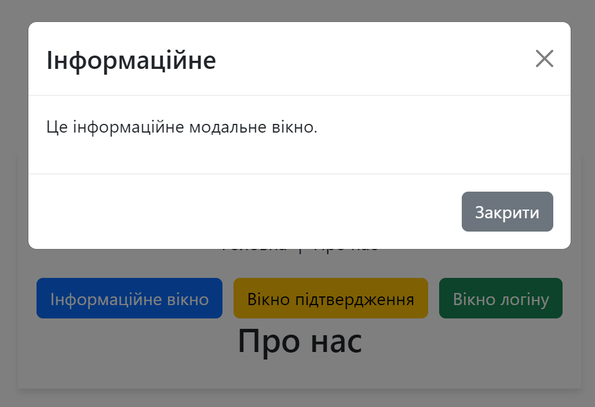
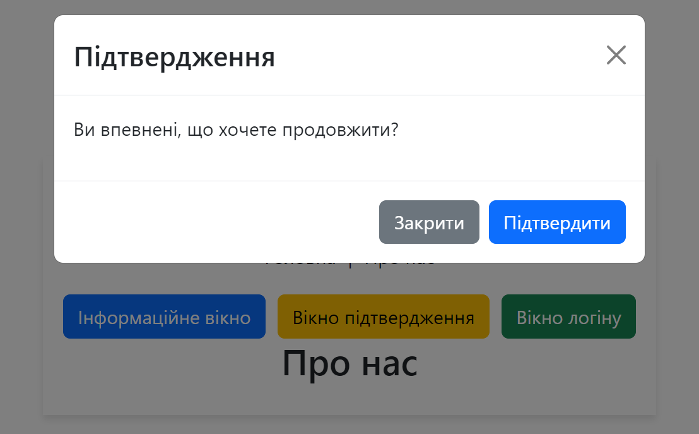
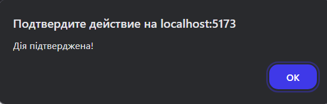

# Modal App

### React, Vite, Bootstrap

- [src/](./src/)
  * [components/](./src/components/)
    - [About](./src/components/About.jsx)
    - [Home](./src/components/Home.jsx)
    - [Modal](./src/components/Modal.jsx)
  * [App](./src/App.jsx)

